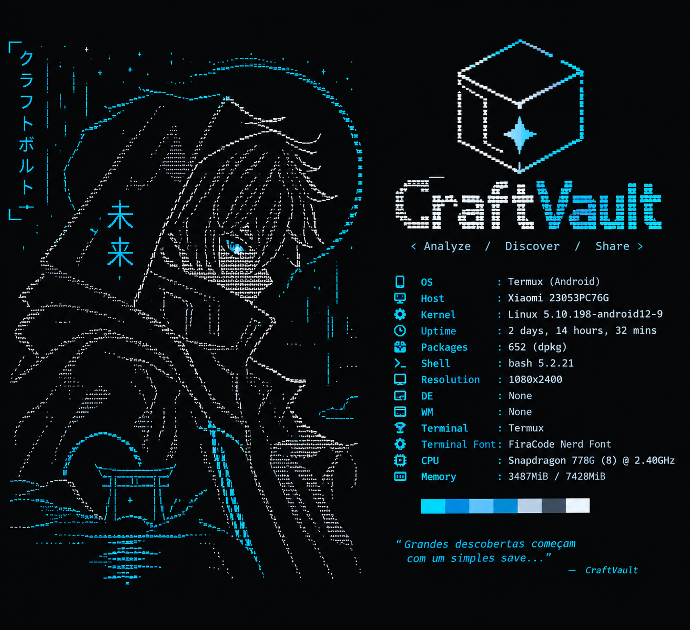

# ⬡ CraftVault

**Explore, analise e organize seus saves de Infinite Craft**

[Demo](#) · [Reportar Bug](https://github.com/tsuki0-0/craftvault-web/issues) · [Sugerir Feature](https://github.com/tsuki0-0/craftvault-web/issues)

---

## 📖 Sobre o Projeto

**CraftVault** é uma ferramenta web para explorar, analisar e organizar os elementos e combinações que você descobriu jogando **Infinite Craft**. Importe seus saves, navegue pela sua árvore de descobertas, busque elementos específicos e mantenha tudo organizado em um só lugar.

## ✨ Funcionalidades

- 🗂️ **Visualização de saves** — carregue e explore seus dados salvos do Infinite Craft
- 🔍 **Busca inteligente** — encontre elementos e combinações rapidamente
- 🏷️ **Categorização** — organize elementos por categorias e critérios personalizados
- 📊 **Análise de dados** — estatísticas e insights sobre seu progresso no jogo
- 💾 **Gerenciamento de dados** — importe, exporte e mantenha seus saves seguros

## 🛠️ Tecnologias

| Camada | Tecnologia |
|---|---|
| Framework | React + TypeScript |
| Build tool | Vite |
| Linting | Oxlint |

O projeto estará disponível em `Link do vercel`.

## 🗺️ Roadmap

- [✓] Você faz a Importação dos seus saves do Infinite Craft
- [✓] Verificação de quantos Itens Criados no SEU SAVE!
- [✓] Modo escuro
- [❌] Compartilhamento de coleções de save

## 🤝 Contribuindo

Contribuições são bem-vindas! Sinta-se à vontade para abrir uma [issue](https://github.com/tsuki0-0/craftvault-web/issues) ou enviar um pull request.

1. Faça um fork do projeto
2. Crie sua branch (`git checkout -b feature/nova-funcionalidade`)
3. Commit suas mudanças (`git commit -m 'Adiciona nova funcionalidade'`)
4. Push para a branch (`git push origin feature/nova-funcionalidade`)
5. Abra um Pull Request

## 📄 Licença

Distribuído sob a licença MIT. Veja `LICENSE` para mais informações.
---

Feito com 💙 por [Tsuki0-0](https://github.com/tsuki0-0) e [Vuthos](https://github.com/Vuthos)

